# Dual AI Agent Race via MCP Servers — "Cop & Thief"

> Course: **Orchestration of AI Agents**, University of Haifa — Task 6 (ex06).
> This README is the project's **user manual** *and* its **living scientific report**.
> Engineering standards: [`MATERIALS/software_submission_guidelines-V3_Summary.md`](MATERIALS/software_submission_guidelines-V3_Summary.md).
> Design docs: [`docs/`](docs/) ([PRD](docs/PRD.md) · [PLAN](docs/PLAN.md) · [TODO](docs/TODO.md) · [Audit](docs/AUDIT-2026-06-25.md)).

**Status:** 🟩 Implemented — the full pipeline runs end-to-end. 249 tests, 100% coverage, Ruff clean.

---

## 1. Overview
Two autonomous AI agents — a **Cop** and a **Thief** — play a pursuit game on a 2-D grid. Each agent is
backed by its **own MCP server (FastMCP)** and they coordinate in **natural language** under
**partial observation**. A full match is **6 sub-games** (≤25 moves each), run end-to-end with no
manual intervention. The project also ships a **Gmail & Calendar agent** (read inbox → extract a
meeting invite → add a Calendar event → send email); when the match ends, it emails the JSON result.

See [`docs/PRD.md`](docs/PRD.md) for full requirements.

## 2. Installation

### 2.1 System requirements
- **Python ≥ 3.10**
- **[`uv`](https://docs.astral.sh/uv/)** package manager (the only supported manager — no `pip`/`venv`)
- OS: Windows 10/11, macOS, or Linux
- An **LLM provider** — a cloud API key (Anthropic/OpenAI/Gemini) **or** local Ollama (see `docs/PRD.md` FR-7)
- A **Google Cloud OAuth Desktop client** for Gmail/Calendar (see [`docs/PRD_gmail_calendar_agent.md`](docs/PRD_gmail_calendar_agent.md))

### 2.2 Install `uv`
```powershell
# Windows (PowerShell)
powershell -ExecutionPolicy ByPass -c "irm https://astral.sh/uv/install.ps1 | iex"
```
```bash
# macOS / Linux
curl -LsSf https://astral.sh/uv/install.sh | sh
uv --version   # verify
```

### 2.3 Install the project
```bash
uv sync          # creates the venv and installs locked dependencies
```

### 2.4 Environment & secrets
1. Copy the template: `cp .env-example .env`
2. **Add your OpenAI API key** in `.env` (git-ignored): `OPENAI_API_KEY=sk-...`. The app auto-loads
   `.env` on every run, so once it's there the natural-language match always uses OpenAI. The model is
   set in `config/config.json` → `llm.model` (default `gpt-4o-mini`). Without a key it runs offline.
3. Put `client_secret.json` in a **secret folder OUTSIDE this repo** and set `MARL_GOOGLE_SECRETS_DIR`
   in `.env` to that folder (or point `google.secrets_dir` in `config/config.json` at it). `token.json`
   is written there on first consent.
4. **Verify the Google setup** (one command, does the first-run consent + the read→extract→calendar→send
   demo, sending a test email to your own dev address): `uv run python scripts/google_smoke.py`. A browser
   opens for OAuth consent — **log in as a Test user** (`sharbelma3@gmail.com`); after that `token.json`
   is cached and runs are autonomous.

### 2.5 Troubleshooting
| Symptom | Fix |
|---|---|
| `uv sync` fails | Confirm Python ≥3.10 and a fresh terminal after installing `uv`. |
| OAuth "Access blocked / unverified app" | Normal in Testing mode — ensure your Gmail is in **Test users**. |
| Token expired / wrong scopes | Delete `token.json` → re-run → re-consent in the browser. |
| MCP cloud URL unreachable | Avoid org networks blocking non-standard ports; verify firewall/token (see PLAN §3). |

## 3. Usage

### 3.1 Run it — one command
| Command | What it does |
|---|---|
| `uv run cop-thief` | **Natural-language match** (the assignment) → prints the JSON summary |
| `uv run cop-thief --gui` | **Natural-language match → animated GIF** with the agents' NL messages overlaid (`assets/match_nl.gif`) |
| `uv run cop-thief --simple` | Simple heuristic match (no natural language, no LLM) |
| `uv run cop-thief --simple --gui` | Heuristic/`smart` match → `assets/match.gif` |
| `.\run.ps1 [--simple\|--gui]` | Windows wrapper (shortest) |

**Full real run with the GUI:** put your key in `.env` (`OPENAI_API_KEY=sk-...`, see §2.4), then
`uv run cop-thief --gui` — this animates a natural-language sub-game where the cop and thief move on the
board **and** their LLM-interpreted NL messages appear under each frame (`assets/match_nl.gif`). Without a
key it runs the same NL pipeline on a deterministic **offline** backend (no network, no cost). Long form:
`uv run python -m marl_cop_thief [--simple\|--gui]`. All parameters (grid size, moves, scoring, seed,
report recipient, `llm.model`, `strategy.type`) come from `config/config.json` — no flags for them.

### 3.2 Typical workflow
Add `OPENAI_API_KEY` to `.env` → `uv run cop-thief` to watch a natural-language match → `uv run cop-thief
--gui` to render the animation → (with Google OAuth set up) the report email is sent after the 6 games.

### 3.3 Example output
```text
$ uv run cop-thief
{ "sub_games": [ { "index": 0, "winner": "cop", "moves_used": 8, "cop_score": 20, "thief_score": 5 }, ... ],
  "totals": { "cop": 90, "thief": 40 } }
```
A natural-language run log is in [`results/nl_match_sample.txt`](results/nl_match_sample.txt) (see R.5).

## 4. Architecture
Summary in [`docs/PLAN.md`](docs/PLAN.md) (C4 model, ADRs, module layout). Diagrams go in `assets/`.
**Standards alignment:** ISO/IEC 25010 (quality), MIT SQA, Google/Microsoft API guidelines, and
Nielsen's 10 usability heuristics (GUI/CLI) — see [`docs/PLAN.md`](docs/PLAN.md) and `docs/PRD.md` §4.

## 4.1 Deploying the MCP servers (cloud)
The two MCP servers run over HTTP via [`scripts/run_mcp_server.py`](scripts/run_mcp_server.py)
(binds `0.0.0.0:$PORT`, gated by `MCP_AUTH_SECRET` → `TokenAuth`). Two options:

**A. Render (recommended — stable URL, runs without your PC):** push to GitHub → on Render pick
**Blueprint** ([`render.yaml`](render.yaml) deploys `cop-mcp` + `thief-mcp` from the [`Dockerfile`](Dockerfile))
→ set `MCP_AUTH_SECRET` (same value for both) in the dashboard → copy the two `*.onrender.com` URLs into
`.env` as `COP_MCP_URL` / `THIEF_MCP_URL`. (Free tier cold-starts after ~15 min idle.)

**B. ngrok (fastest, for a live match):** run locally —
`uv run python scripts/run_mcp_server.py --role cop --port 8001` and `--role thief --port 8002` — then
`ngrok http 8001` / `ngrok http 8002` for two public URLs. (URLs change per restart; needs your PC on.)

Either way the server prints a valid bearer token on startup; the client carries it via `McpClient`.
**Verify the deployed URLs:** set the same `MCP_AUTH_SECRET` in your local `.env`, then
`uv run python scripts/check_mcp.py` — it mints a token and calls `get_game_status` on each server
through `McpClient` (gatekeeper-routed). A `401` means the server is up and **auth is enforced** but your
local secret doesn't match Render's; an `[OK]` with status means full end-to-end success.

### Live inter-group match (cross-network)
Two teams play on **one shared authoritative game** via a role-parameterized **host** server:
1. **One team hosts:** `uv run python scripts/run_mcp_server.py --role host --port 8000` (deploy it, or
   `ngrok http 8000`). Mint a token: `uv run python scripts/mint_token.py`, then share **the host URL + token**.
2. **Both teams** put the agreed host in `.env` — **this is where the partner's URL + token go:**
   ```
   HOST_MCP_URL=https://<the-host>.onrender.com
   HOST_MCP_TOKEN=<the bearer token>
   ```
   (Partner hosts → paste *their* URL + the token *they* sent. You host → your URL + a token you minted.)
3. **Each team runs only its own role** against the host — one cop, one thief:
   ```
   uv run python scripts/play_remote.py --role cop      # you
   uv run python scripts/play_remote.py --role thief    # partner
   ```
   Each driver polls for its turn, observes, decides client-side (ADR-001), and submits over MCP
   (gatekeeper-routed, token-authenticated). `services/remote_match.py` is the reusable engine.
   When the game ends, `play_remote.py` builds a JSON result report and — if `reporting.send_real_email`
   is `true` — **emails it to `reporting.recipient_email`** (currently your own address, `sharbelma3@gmail.com`).

---

# 📊 Project Report / Results

> **Reporting rule:** we report **everything we do** here as we go — every feature, experiment, and
> decision — with **graphs and screenshots whenever possible**. Images live in `assets/`, generated
> plots and run outputs in `results/`. Updated continuously, not only at submission.

## R.0 Implementation status (code)
| Phase | Component | Status | Evidence |
|---|---|---|---|
| 0 | Scaffolding (uv, config, version/constants, loader) | ✅ done | ruff clean · 100% cov |
| 1 | Game engine (board, models, engine, scoring, barriers) | ✅ done | 100% cov |
| 2 | MCP tool layer + 2 FastMCP servers | 🟦 partial | tools/observation/bus/servers + **HTTP client transport** (`McpClient`, gatekeeper-routed) + **token auth** (`TokenAuth`: HMAC mint/verify/revoke) done; cloud deploy of the URLs pending (Phase 7) |
| 3 | Orchestrator + SDK + CLI (full local match) | ✅ done | `python -m marl_cop_thief` runs |
| 4 | Decision strategy | ✅ done | cop: greedy + **cornering "smart"** (1-ply look-ahead); thief: greedy baseline + **"smart" evasion** (default, flees + keeps escape room, roams the board); all config-selectable; Q-table optional/pending |
| 5 | Natural-language + LLM | ✅ done | NL encode/decode, ambiguity handler, NL decider; **LLM-written in-character speech** (cop/thief personas, template fallback offline); LLM via gatekeeper |
| 6 | GUI | ✅ done | **modern-dark themed** board (glow cop/thief tokens, barrier slabs, movement trails, capture flash, HUD scoreboard, speech bubbles) · GIF (`--gui`) + **live real-time window** (`--live`, auto-closes when done) |
| 8 | Report builder + Gmail/Calendar agent | ✅ done* | JSON builders + tools + **report-email wiring** (`match_reporter`→SDK→CLI, gated by `send_real_email`); **real OAuth verified** on live Google (consent + read + extract + calendar + **real email sent**). *Inter-group bonus arithmetic + cloud series pending |
| 9 | API gatekeeper | ✅ done | config-driven rate limit + FIFO queue + backpressure + drain + retries/backoff + concurrency + `get_queue_status` (see R.9) |
| 7 | Cloud deploy | ✅ done* | **deployed + verified end-to-end on Render** — `cop-mcp`/`thief-mcp` live at public HTTPS URLs with token auth; an **authenticated `get_game_status` tool call succeeds** through `McpClient` on both (`results/cloud_check.txt`); unauthenticated → 401 (S5). Live 6-game inter-group match vs `salareen` **done — won 60–40**, JSON result emailed (R.1) |
| 10 | Research/submission | 🟦 partial | audit closure batches 1–2 done; final submission steps pending |

Whole suite: **249 tests, 100% coverage, Ruff zero-violation.** Every `uv run pytest` emits an automated
**JUnit + coverage report** to `results/` (pass/fail per test); expected results and how to regenerate are
in [`results/TEST_REPORT.md`](results/TEST_REPORT.md), with a captured run log at
[`results/test_run.log`](results/test_run.log) (guidelines §6.4). The NL match is runnable via
`uv run cop-thief` (NL is the default; `--simple` for heuristic; `--gui` for a GIF; `--live` for a live
window). The Gmail/Calendar tools are dependency-injected (tested with
fakes); `shared/google_auth.py` builds the real services and needs your Google OAuth `client_secret.json`.

## R.1 Work Log (running changelog)
Newest first.

| Date | What we did | Why | Evidence |
|------|-------------|-----|----------|
| 2026-06-26 | **Live inter-group match vs partner team `salareen` — WON 60–40** — built the full interop for their **custom JSON-over-HTTP `/decide` protocol** (not MCP): `services/partner_protocol` (coord/direction mapping — their `[row,col]` = our `(y,x)`, 4-dir, no stay/diagonals), `strategy/ortho_policy` (our 4-dir cop/thief policy), gatekeeper-routed `shared/partner_client`, and `services/interop_match` (**we** own the engine; our policy plays our role, their `/decide` plays theirs; 6-game 3-cop/3-thief swap). Exposed via `Sdk.run_interop_series` + `scripts/play_partner.py`; reachability probe `scripts/check_partner.py`. Played **6 live games (66 gatekeeper-routed `/decide` calls)** → **us 60 / salareen 40**, JSON result **emailed**. Found + handled: their cop `/decide` **500s on `place_barrier`** → interop is moves-only (`allow_barrier` off by default). | The §12 inter-group bonus match, working end-to-end across two different agent protocols | `docs/PRD_partner_interop.md`; `services/{partner_protocol,interop_match}.py` · `shared/partner_client.py` · `strategy/ortho_policy.py`; **266 tests, 100% cov**, Ruff clean |
| 2026-06-26 | **Closed the standards-evaluation gaps** — (1) **Gmail/Calendar now route through the central gatekeeper** (`shared/google_api.execute_request`; `gmail` service in `rate_limits.json`), wired into the CLI + remote drivers, so *all* external calls (LLM · MCP · Gmail/Calendar) are gatekept (CLAUDE §2); (2) inter-group **bonus award values are config-driven** (`config.bonus` via `bonus.points_from_config`), not hardcoded; (3) **DRY** — `remote_match` distances unified onto new `shared/grid_math` (shared with `strategy/geometry`); (4) docs reconciled (task count **689** across TODO/CLAUDE/PROMPT_LOG; PRD/PLAN Draft→Approved; removed the report-send contradiction; PLAN **C4-L4 + deployment view** added); (5) `pyproject` `0.1.0`→`1.0.0`; coverage `omit` justified inline | Close the engineering-standards evaluation findings (gatekeeper §2, no-hardcode §7.2, DRY §4.2, doc consistency, versioning §8.1) | `shared/{google_api,grid_math}.py`; **249 tests, 100% cov**, Ruff clean |
| 2026-06-25 | **Live remote flow emails the result** — `remote_match.build_match_report` turns the finished game's status into a JSON report (role/winner/scores); `play_remote.py` emails it via `send_report` when `reporting.send_real_email=true`, to `reporting.recipient_email` (kept as the dev address `sharbelma3@gmail.com`, not the lecturer, per request) | Get the live-match result by email; both teams can send the same JSON for the bonus | `services/remote_match.py` (100% cov); 239 tests, 100% cov |
| 2026-06-25 | **Stronger live-match heuristic** — upgraded `remote_match.remote_decider` (observation-only, per assignment §4): now **edge/barrier-aware** (filters legal steps from `visible_cells`/`visible_barriers` → no wasted illegal→STAY turns), **searches when blind** (heads for the visible interior instead of standing still — a still cop hands the thief the clock), cop tie-breaks by **alignment then mobility** (corners the thief), thief tie-breaks by **escape room** | A stronger heuristic wins more inter-group games ⇒ more bonus | `services/remote_match.py` (100% cov); 236 tests, 100% cov |
| 2026-06-25 | **Cross-network match driver (live inter-group play)** — role-parameterized `mcp/host_server.py` (one shared authoritative game), `services/remote_match.py` (`play_my_turns` polls the host, acts only on its role's turn, observe→decide→submit; greedy `remote_decider`; never stalls — illegal→STAY), `scripts/play_remote.py` (`--role cop|thief` over `HOST_MCP_URL`/`HOST_MCP_TOKEN`), `run_mcp_server.py --role host`. Both teams run their own role against one host | Enable a real live match vs a partner team over MCP (T7.19) | `services/remote_match.py` (100% cov); README §4.1 live-match guide; 233 tests, 100% cov |
| 2026-06-25 | **TODO reconciliation + token helper** — flipped the stale-done template rows to ✅ with evidence (Phase 1/2/3 behaviours, Phase 8 Google setup + google_auth/calendar, Phase 9 config/version + quality gates + R.x-backed docs); left optional/by-design (q_table, strategy_base, logging_setup, cli_runner) and process/blocked rows honest. Added `scripts/mint_token.py` to issue partner bearer tokens | Make the TODO honestly reflect the ~complete state; ease partner onboarding | `docs/TODO.md`; `scripts/mint_token.py`; 228 tests, 100% cov |
| 2026-06-25 | **Inter-group series runner** — `services/series_runner.run_series(config, a, b)` plays the **6-game 3-cop/3-thief role-swap** (§12.1), accumulates `totals_by_group`, and builds the `bonus_game` report incl. `bonus_claim`; generic `match_reporter.send_report` emails any report (JSON-only, gated). Exposed via `Sdk.run_series`/`send_report` + `scripts/run_series.py`. Live cross-group play swaps local policies for the opponent's remote MCP servers (`McpClient`) | Be plug-and-play for the inter-group bonus the moment a partner appears (T9.84) | `services/series_runner.py`; 228 tests, 100% cov; PRD_email_reporting §4 |
| 2026-06-25 | **Cloud verified end-to-end** — with the matching `MCP_AUTH_SECRET` set, an **authenticated `get_game_status` call succeeds on both** cloud servers via `McpClient` (gatekeeper-routed): `{to_move: thief, moves_used: 0, moves_left: 25, ...}`. Full stack proven: Render deploy → token auth → transport → live MCP tool call | Prove the cloud MCP layer works end-to-end (G4/G5/S5) | `results/cloud_check.txt` |
| 2026-06-25 | **Cloud servers deployed + verified (Render)** — `cop-mcp` & `thief-mcp` live at public HTTPS URLs; `scripts/check_mcp.py` connects via our `McpClient` (gatekeeper-routed) and confirms **both enforce token auth** (unauthenticated → 401, assignment S5). URLs added to `.env` | The 2 public authenticated MCP URLs the assignment requires (G4/G5) | `scripts/check_mcp.py`; `cop-mcp.onrender.com` / `thief-mcp.onrender.com`; 222 tests, 100% cov |
| 2026-06-25 | **Inter-group bonus scoring** — `services/bonus.py`: `series_awards` (higher score 10 / loser 5 / tie 5-5; disagreement voids 0-0) builds the report's `bonus_claim`; `final_bonus` averages a group's awards over valid series. Exposed via `Sdk.bonus_awards`/`bonus_final`; award values parameterized (staff-confirmable, C5) | Assignment §12.2 bonus arithmetic (T10.42) | `services/bonus.py`; 222 tests, 100% cov; PRD_email_reporting §4 |
| 2026-06-25 | **Cloud deploy scaffolding (Render + ngrok)** — `scripts/run_mcp_server.py` runs the cop/thief FastMCP server over HTTP (`0.0.0.0:$PORT`) gated by `TokenAuth` (FastMCP `TokenVerifier` bridge); `Dockerfile` + `render.yaml` (two services from one image); README §4.1 step-by-step. Verified offline: authed server builds + exposes all 6 tools, verifier accepts/rejects tokens | Enable the 2 public MCP URLs (assignment Phase 2/7) | `scripts/run_mcp_server.py`, `Dockerfile`, `render.yaml`; 213 tests, 100% cov |
| 2026-06-25 | **MCP transport + token auth (cloud prerequisite)** — `shared/mcp_auth.TokenAuth` mints HMAC-signed, tamper-evident bearer tokens with `verify`/`revoke` (`MCP_AUTH_SECRET`); `shared/mcp_transport.McpClient` makes gatekeeper-routed, token-authenticated remote tool calls (low-level `invoke` injected → offline-testable). Unblocks any cloud deploy (Prefect/ngrok/web host) | Assignment §6 token auth+revocation (C18) + Phase 2/7 transport (T2.34–55) | `shared/{mcp_auth,mcp_transport}.py`; 213 tests, 100% cov; PRD_mcp_server §2.2/§6 |
| 2026-06-25 | **Auto report-email wiring (init→report autonomy)** — `services/match_reporter.send_match_report` turns a finished match summary into the JSON report and emails it via an injected sender, **gated by `reporting.send_real_email`** (default off). Exposed as `Sdk.send_match_report`; the CLI builds the real Gmail service and sends after a full match. Added `reporting.report_meta` config | Close the "fully autonomous init → report email" goal (G1/G6, T8.101) | `services/match_reporter.py`; 203 tests, 100% cov; PRD_email_reporting status updated |
| 2026-06-25 | **Real Google run verified + Calendar timeZone fix** — ran `google_smoke.py` on live Google: OAuth consent ✓, `token.json` ✓, `read_emails` ✓, `extract_meeting` ✓, **real email sent** ✓. `add_calendar_event` failed with *"Missing time zone definition"* → fixed: `add_calendar_event(timezone=...)` now sends `timeZone` from `reporting.timezone` (audit C12). Also fixed a Hebrew **RTL path bug** in the user's secrets path (switched to ASCII `C:\cop-thief-secrets`) | First real end-to-end Google verification surfaced a genuine API bug | `calendar_writer.py`; 198 tests, 100% cov; PRD_gmail_calendar §2; TODO T8.92/94/99/100/102, T10.45/46/48 done |
| 2026-06-25 | **Google setup verification script** — `scripts/google_smoke.py` does the one-time OAuth consent + full read→extract(LLM)→add-Calendar-event→send-email demo (test email to the dev address), each step defensive. Browser-agent set up Google Cloud (project `cop-thief-agent`, Gmail+Calendar APIs, External/Testing OAuth, Desktop client, test user) + OpenAI key + Prefect workspace | Now that real credentials exist, give a one-command way to verify + first-consent (T10.45/46, T8.102) | `scripts/google_smoke.py`; README §2.4; uses existing tested tools |
| 2026-06-25 | **Phase 10 batch 2 docs + non-square sanity** — non-square match test (3×2, 4×3); PRD §1.5 market/landscape + §1.6 relative-path note; PLAN §3 production secret-store + MCP HTTP-transport (not stdio) + token encrypt/revoke notes; PRD_game_engine special-action clarification | Close audit gaps C6/C14/C15/C18/C21, gap10/37/53/61 | `test_match_runs_on_non_square_boards`; PRD §1.5/1.6, PLAN §3; 197 tests, 100% cov |
| 2026-06-25 | **Budget management (gatekeeper spend counter)** — `shared/budget.py` `BudgetTracker` reads the live gatekeeper call count + config `llm.budget.usd_per_call` for a real-time spend/remaining counter, `forecast_usd(n)`, and a two-stage **alert** (`alert_threshold`) / **over_budget** flag; the CLI prints it after a real run | Required cost forecasting + real-time monitoring + overrun alerts (audit C14/C20) | `shared/budget.py`; 196 tests, 100% cov; README R.7 + config `llm.budget` |
| 2026-06-25 | **Phase 9 research & visualization** — `scripts/sensitivity.py` runs OAT sweeps (visibility radius, grid size) over real offline matches and renders the full chart suite (**line, heatmap, box, scatter**); added `notebooks/analysis.ipynb` (LaTeX Dec-POMDP + Bellman, sensitivity results, 6 academic references). Key finding: NL capture needs visibility (r=0≈blind), peaks at r=1–2, and degrades with board size | Required sensitivity research + visualization (guidelines §11; T9.61–69, T10.23–25) | README R.3 sensitivity section; `assets/sensitivity_*.png`, `moves_boxplot.png`, `scatter_area_moves.png`; `results/sensitivity.txt` |
| 2026-06-25 | **Phase 10 audit/quality closure (batch 1)** — automated **JUnit + coverage report** to `results/` on every `pytest` run + `results/TEST_REPORT.md` (expected results) + committed `test_run.log`; **ISO/IEC 25010** self-assessment (R.10); **Nielsen 10 heuristics + accessibility + standards alignment** (R.11); **`docs/EDGE_CASES.md`** register; **extension-points** table (PLAN §4.1); `__init__.py` in all test dirs | Close graded scientific/quality gaps (guidelines §6.4, §10, §17; audit T10.8–31) | README R.10/R.11, `results/TEST_REPORT.md`, `docs/EDGE_CASES.md`, PLAN §4.1; 189 tests, 100% cov |
| 2026-06-25 | **Smarter thief — fixed the "always goes left" drift** — greedy evasion tied on distance and the fixed `DIRECTIONS_8` order made `max` pick the leftmost move every time. Added a config-selectable `smart` thief (default) ranking moves by `(distance, mobility, centrality)` via `strategy/evasion.py`, used by the simple match, the NL belief-based `_choose`, and the GUI; greedy retained as the R.3 baseline | "The thief keeps making the same move, not smart/varied" — reported in R.3 | `strategy/{smart_thief,evasion}.py`; 189 tests, 100% cov; honest capture trade-off in R.3/PRD §4 |
| 2026-06-25 | **Fixed clipped speech bubbles** — the NL message bubble (and title) were cut off the figure edge because `tight_layout` squeezed the axes; reserved explicit top/bottom margins (`subplots_adjust`) and dropped `tight_layout`, so each turn's spoken line is fully visible below the board | "I don't see the comments the agents send" — bubbles were rendered but off-frame | `gui/{board_renderer,overlays}.py`; regenerated `assets/*`; 180 tests, 100% cov |
| 2026-06-25 | **Modern-dark GUI redesign** — new `gui/theme.py` (dark palette + `glow()` halo) and `gui/overlays.py` (HUD banner/move-counter/legend + rounded **speech bubble** on the speaker); `board_renderer` now draws a dark board with **glowing cop/thief tokens**, barrier slabs, faded **movement trails**, and a **capture flash** on a cop win (renderer stays stateless; trails + `max_moves` passed in) | "Make the GUI very very beautiful" | `assets/board_state.png`, `match.gif`, `match_nl.gif` (regenerated); 180 tests, 100% cov, Ruff clean |
| 2026-06-25 | **LLM-written, in-character speech** — added a pluggable `Speaker`: `nl_speak.llm_speaker` asks the LLM (persona prompt B5) to voice each move freshly (cop = heroic + implies cell; thief = sly + cryptic), replacing the fixed `nl_encode` templates. Enabled with a real key + `llm.creative_speech`; falls back to templates on empty/error/offline. **Live window now auto-closes** after the game (`gui.close_on_finish` + `final_hold_seconds`) | The bottom-of-screen lines were identical templates (only coords changed) — make them genuinely generative; and the window lingered after the game ended | `nl_protocol/{nl_speak,prompt_templates}.py`; **180 tests, 100% cov**, Ruff clean; ~2× LLM calls (R.7) |
| 2026-06-25 | **Live window no longer freezes** — moved frame production (which blocks on the per-turn LLM call) onto a **daemon worker thread** feeding a `queue.Queue`; the Tk event loop keeps the **main thread** and drains one frame per tick via `fig.canvas.new_timer` (`gui.poll_interval_ms`). Extracted pure `_produce`/`_render_tick` helpers (unit-tested). Config key `gui.turn_delay_seconds` → `gui.poll_interval_ms` | Window showed "not responding" while waiting for the next turn (blocking call on the GUI thread) | `gui/live_viewer.py`; PLAN §4 threading note; docs-first |
| 2026-06-25 | **Live real-time GUI window** — `cop-thief --live` opens an interactive window that draws each turn the instant the engine computes it (so an NL match advances as each LLM call returns). Refactored the game loop into service-layer per-turn *frame streams* (`services/match_stream.py` `stream_subgame`/`heuristic_subgame_stream` + `nl_subgame_stream`); the GIF animator now collects the same stream (DRY); exposed via SDK (`stream_simple_frames`/`stream_nl_frames`); backend config-driven (`gui.live_backend`) | The GIF was a recording, not real-time — user wanted to watch the game live | `gui/live_viewer.py`; **166 tests, 100% cov**, Ruff clean; docs-first (PLAN §4, PRD FR-11, TODO T6.39–48) |
| 2026-06-25 | **GUI now animates the NL match** — `cop-thief --gui` renders the natural-language sub-game with each turn's NL message overlaid (real OpenAI when keyed, else offline); `--simple --gui` keeps the heuristic/smart GIF | One command to *see* the full NL run, not just text | `assets/match_nl.gif`; 154 tests, 100% cov; `peek_last` bus API + `nl_subgame_frames` |
| 2026-06-25 | **Token-cost analysis (R.7)** — `token_cost.py` util + `token_report.py` capture real prompts from an offline match; filled the cost table (config-driven gpt-4o-mini pricing) | Required cost analysis now that OpenAI is wired | **66 calls, 3310 tokens, $0.000615/match**; 149 tests, 100% cov; `results/token_cost.txt` |
| 2026-06-25 | **Phase 4: cornering "smart" cop** — 1-ply look-ahead ranking actions by `(distance, thief escape-options)` after the thief's reply; config-selectable (`strategy.type`); refreshed comparison graphs | Greedy cop fell into limit cycles and let the thief escape (R.3) | **Capture 0.72→1.00** on 5×5; 100% on 3×3–7×7; 144 tests, 100% cov; `smart_cop.py` + `geometry.py`; graphs in `assets/` |
| 2026-06-25 | **Phase 9: full API gatekeeper** — config-driven rate limiting (`rate_limits.json`), FIFO overflow queue with backpressure alert + drain-on-reset, retries with backoff, `concurrent_max` semaphore, thread-safe `RLock`, `get_queue_status()`; injected clock/sleep for deterministic offline tests; **adversarial multi-agent review** then fixed 6 confirmed defects (ticket-leak deadlock, retries bypassing the limiter, prod path not loading `rate_limits.json`, backpressure off-by-one, version validation, drain test) | Required centralized chokepoint (CLAUDE §2); close T9.1–11/45–50 | 134 tests, 100% cov; `shared/{gatekeeper,rate_limit}.py`; demo → [R.9](#r9-api-gatekeeper-rate-limiting--queueing) |
| 2026-06-25 | Made **NL the default** (`cop-thief`; `--simple` for heuristic) + wired a **real OpenAI backend** auto-loaded from `.env` | NL is the assignment; use a real LLM | 111 tests; offline fallback intact |
| 2026-06-25 | Synced `docs/PLAN.md` to the as-built tree; added a **single-command** runner (`cop-thief` console script + `run.ps1`) | Keep docs accurate; simpler UX | `uv run cop-thief` works |
| 2026-06-25 | **Phase 6**: GUI board renderer + match animator (`--gui` → animated GIF) + smoke tests | Visualize the game; required screenshots | 108 tests; `assets/match.gif` |
| 2026-06-25 | Generated **experiment graphs + board screenshots + NL log** from real runs; filled README R.3–R.5 | Report results with evidence | `scripts/make_figures.py`; 5 PNGs in `assets/`, log in `results/` |
| 2026-06-25 | **NL match runnable** (then `--nl`, now the default `cop-thief`) + **Phase 8** report builder (internal + inter-group JSON) and Gmail/Calendar agent tools (read/extract/calendar/send, dependency-injected) | Make NL playable + build the submission report | 106 tests, 100% cov; NL CLI works (workflow-authored) |
| 2026-06-25 | **Phase 5**: NL encode/decode + ambiguity handler + NL decider; **minimal gatekeeper** + LLM client; agents coordinate in free text via the LLM-through-gatekeeper | The graded core: NL coordination under partial obs | 86 tests, 100% cov; NL sub-game runs offline |
| 2026-06-25 | **Phase 2**: MCP tool layer (observation, message bus, tool service w/ turn-ownership) + 2 FastMCP servers exposing 6 tools each | Build the agent communication infra | 72 tests, 100% cov, ruff clean |
| 2026-06-25 | **Phase 3**: orchestrator + turn pipeline + accumulator + SDK + CLI; full autonomous 6-sub-game match runs (heuristic decider) | Wire the end-to-end local match | `uv run python -m marl_cop_thief` works; 55 tests, 100% cov |
| 2026-06-25 | **Phase 1**: game engine — board, models, engine (state machine/legality/capture), scoring, barriers | Build the authoritative rules | 42 tests pass, 100% coverage, ruff clean |
| 2026-06-25 | **Phase 0**: `uv` project, config (versioned), version/constants, config loader | Start the build | 14 tests, 100% cov (commit 3428a02) |
| 2026-06-25 | Ran a 176-agent requirements audit of all MATERIALS vs the repo; closed README/license/Dec-POMDP gaps; added Phase 10 closure tasks | "Did we forget anything?" — found 76+26 gaps | [`docs/AUDIT-2026-06-25.md`](docs/AUDIT-2026-06-25.md) |
| 2026-06-25 | Expanded `docs/TODO.md` to 600+ granular tasks; added `docs/PROMPT_LOG.md` | Lecturer rule (≥550 tasks); prompt log §8.3 | [`docs/TODO.md`](docs/TODO.md), [`docs/PROMPT_LOG.md`](docs/PROMPT_LOG.md) |
| 2026-06-25 | Authored `docs/` suite + integrated Gmail/Calendar agent; created this report section | Docs-first workflow | — |
| 2026-06-24 | Added engineering-standards `CLAUDE.md` + reminder hook | Enforce submission guidelines every session | — |

## R.2 Formal Model (Dec-POMDP)
The game is a Decentralized Partially Observable Markov Decision Process `⟨n, S, {Aᵢ}, P, R, {Oᵢ}, O, γ⟩`:
- **n** = 2 agents (Cop, Thief).
- **S** = grid configuration: cop position, thief position, and the set of barrier cells (on a `W×H` board).
- **{Aᵢ}** = `MOVE(dx,dy)` with `dx,dy ∈ {-1,0,1}` (8-dir), `PLACE_BARRIER` (Cop only), `STAY`.
- **P** = deterministic engine transition (legality + capture), see [`docs/PRD_game_engine.md`](docs/PRD_game_engine.md).
- **R** = scoring table (Cop win 20/5, Thief win 5/10).
- **{Oᵢ}** = each agent's partial local view (within `visibility_radius`) + inbound NL messages.
- **O** = observation function mapping true state → each agent's partial view.
- **γ** = discount factor (used only if the optional Q-learning strategy is enabled).

## R.3 Experiments & Graphs
Generated from **real match runs** by [`scripts/make_figures.py`](scripts/make_figures.py)
(`uv run python scripts/make_figures.py`).

**Match outcomes & move distribution** (5×5, 60 seeds, heuristic):

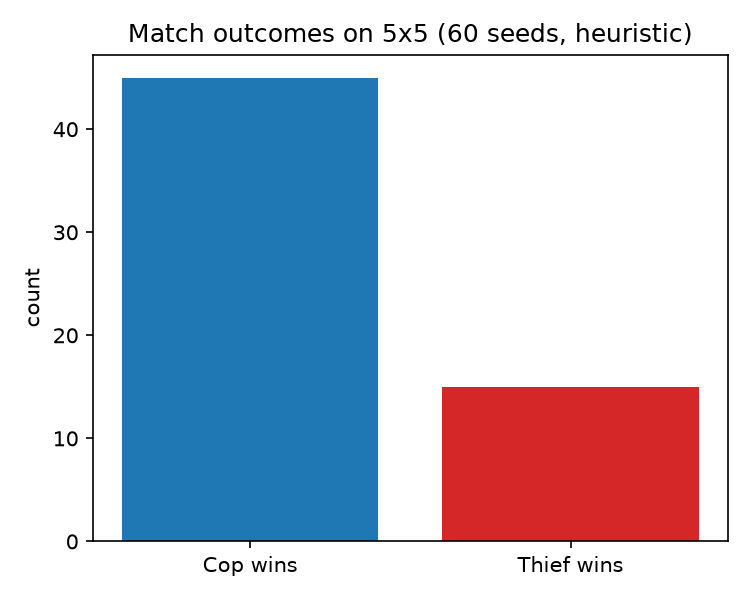
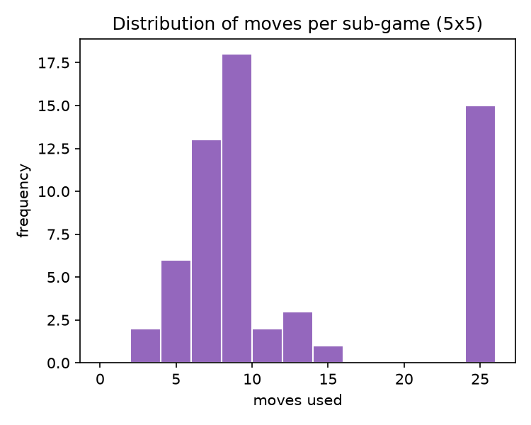

**Sensitivity — cop capture rate vs grid size, greedy vs cornering** (40 seeds per size):

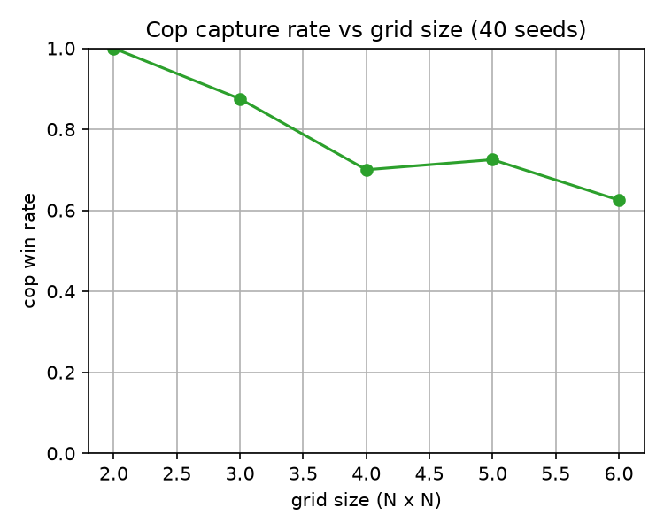

The **greedy** cop's capture rate falls from **100% (2×2)** to **~62% (6×6)** — larger boards give the
thief more room to evade, matching the assignment's sanity-check intuition. The **cornering (smart)** cop
(Phase 4) holds **100% at every size**.

**Strategy comparison — cop win rate by strategy** (5×5, 40 seeds):

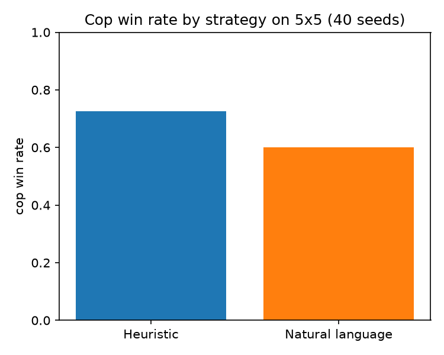

**Finding & fix (Phase 4).** The greedy Chebyshev pursuit falls into a **limit cycle** — the cop
oscillating (2,1)↔(1,2) while the thief mirrors (4,3)↔(3,4) — so the thief survives the 25-move cap
(greedy ≈ 0.72 on 5×5). The **cornering cop** (`strategy.type: "smart"`,
[`smart_cop.py`](src/marl_cop_thief/services/strategy/smart_cop.py)) fixes this with a **one-ply
look-ahead**: it ranks each candidate action by the position it leaves *after the thief's best evasion*,
lexicographically by `(distance, thief escape-options)`. Minimising the thief's escape options herds it
into a corner — where the board edges act as walls and its mobility collapses — lifting capture to
**1.00** on every sampled board. (Barriers only seal the cop's own cell at a tempo cost, so geometric
cornering, not wall-building, is the effective lever here — see
[`docs/PRD_decision_strategy.md`](docs/PRD_decision_strategy.md) §3.1 for the analysis.)

**🐞 Problem & fix — repetitive thief that "always goes left" (Phase 4).** We observed in the GUI that the
thief kept making the *same* move (drifting left) instead of varied, smart moves. **Root cause:** the
greedy thief maximised *only* distance, and because distance ties are common on an open board and
`DIRECTIONS_8` lists the west moves first, Python's `max` always returned the first (left) move — so the
thief hugged one wall. The default thief is now `smart` (`strategy.thief_type`,
[`smart_thief.py`](src/marl_cop_thief/services/strategy/smart_thief.py)): it ranks moves by
`(distance from cop, own mobility, centrality)` so it flees *and* keeps escape room, using the whole
board. As an **honest** consequence, this better evader lowers the cornering cop's capture against it —
**1.00/1.00/0.90/0.88/0.47** on 3×3–7×7 (vs 1.00 against the greedy baseline) — since the cop's look-ahead
still models a greedy thief. The R.3 cop comparison above keeps the greedy thief as the controlled baseline.

### Sensitivity analysis (OAT)
**Methodology:** one-at-a-time (OAT) sweeps — vary a single parameter, hold the rest fixed, average over
many seeds — generated by [`scripts/sensitivity.py`](scripts/sensitivity.py)
(`uv run python scripts/sensitivity.py` → graphs in `assets/`, data in
[`results/sensitivity.txt`](results/sensitivity.txt)). Viz stack: **Matplotlib** (Seaborn/Plotly optional).

**Partial observation matters most** — NL cop capture vs **visibility radius** and **grid size**:

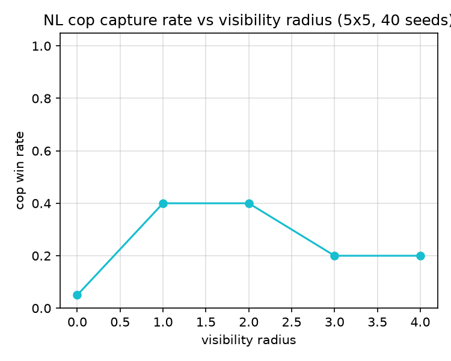
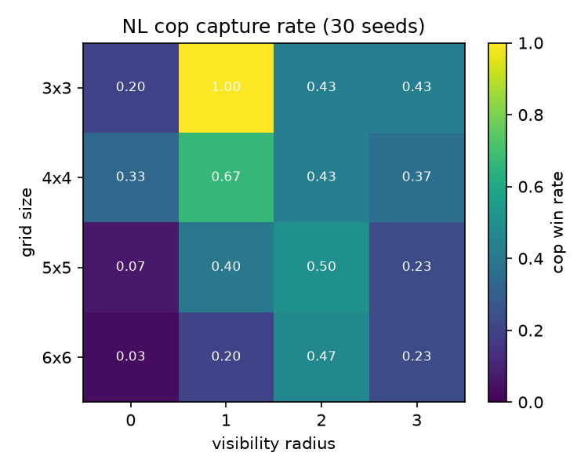

- At **radius 0** (effectively blind, messages only) capture collapses to **0.03–0.20** — the cop can't
  reliably localise the thief from free text alone against a smart evader.
- Capture **peaks at radius 1–2** then *declines* (non-monotonic): a wider view doesn't help a *greedy* NL
  cop that still mirrors the evader — echoing the limit-cycle finding (a cornering NL cop is future work).
- Capture **falls as the board grows** (more room to evade), consistent with the grid-size curve above.

**Game length scales with board size** — moves-per-sub-game distribution (box) and board-area correlation
(scatter), smart-vs-smart:

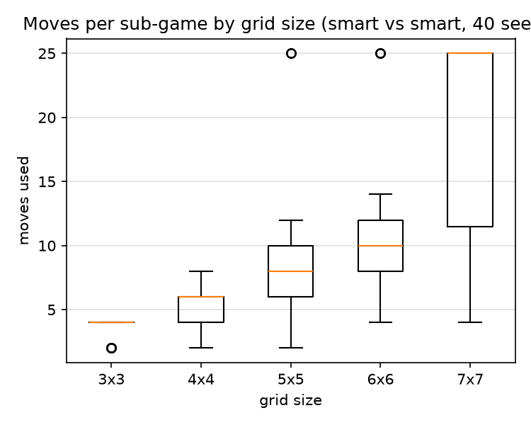
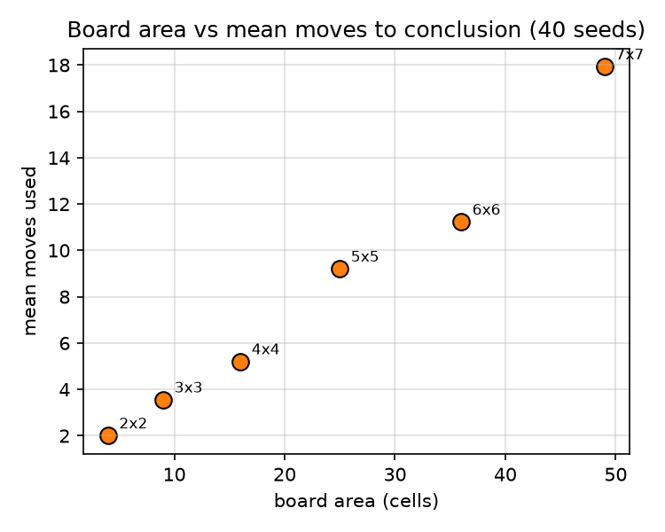

Mean moves-to-conclusion rises ~linearly-to-super-linearly with area (2×2≈2 → 7×7≈18 moves); large boards
cluster at the 25-move cap (escapes), matching the capture-rate drop.

## R.4 Screenshots & GUI (Phase 6)
A **modern-dark theme** (`gui/theme.py`): glowing **cop = blue disc**, **thief = amber star**, barrier
slabs, faded **movement trails**, a **capture flash** on a cop win, and a HUD (turn/winner banner, move
counter, legend) — all rendered from engine state only (no game logic in the GUI). Matplotlib can't draw
colour emoji, so agents are distinct glowing tokens rather than emoji glyphs.

Static board (dark theme, glow tokens, HUD):

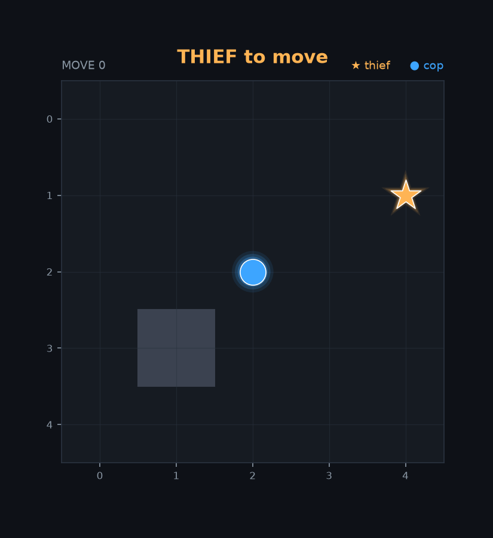

**Natural-language match GUI** — `uv run cop-thief --gui` animates an NL sub-game; each turn's spoken line
appears in a **speech bubble** anchored on the speaker (with a real key the line is **LLM-written and
in-character**; offline it falls back to templates), so you watch the agents *talk* as they move
(`assets/match_nl.gif`):

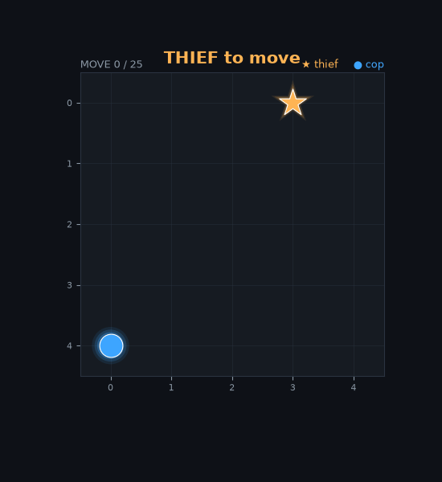

Heuristic/`smart` sub-game (`uv run cop-thief --simple --gui`, the cop closes in and captures):

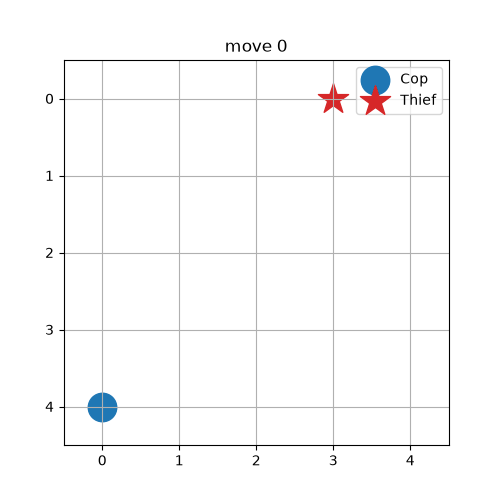

### Live real-time window (`--live`)
The GIFs above are *recordings*. For a **live** view, `uv run cop-thief --live` opens an interactive
matplotlib window (backend from `config.gui.live_backend`, default `TkAgg`) that draws **each turn the
instant the engine computes it** — for the NL match the board advances as every LLM call returns, so you
watch the pursuit unfold move-by-move (add `--simple` for the heuristic/smart match). The window stays on
the final board until you close it. Architecture: the game is exposed as a per-turn *frame stream* from
the SDK (`Sdk.stream_nl_frames` / `stream_simple_frames` → `services/match_stream.py`); the live viewer
and the GIF animator are two render-only consumers of the same stream (SDK-only; GUI holds no game logic).
**Responsiveness:** because an NL turn blocks on an LLM call, the frame generator runs on a **daemon
worker thread** that feeds a `queue.Queue`, while the Matplotlib/Tk event loop owns the **main thread** and
drains one frame per tick via `fig.canvas.new_timer` (`gui.poll_interval_ms`, default 150 ms) — so the
window never goes "not responding" while a turn computes.

#### 🐞 Fault report — live window froze while waiting for a turn
**Symptom (first `--live` build):** clicking the window while it waited for the next turn showed Windows'
**"(Not Responding)"** state. **Root cause:** frames were produced *on the GUI thread*, and producing an NL
frame blocks on the per-turn LLM call, so the Tk event loop stalled for the duration of the call.
**Fix:** moved turn computation to a daemon **worker thread** + `queue.Queue`, leaving the event loop free
on the main thread (timer-drained) — the responsiveness design above. Captured before the fix:


## R.5 CLI Logs & MCP Communication
A natural-language sub-game (full log: [`results/nl_match_sample.txt`](results/nl_match_sample.txt)) —
the thief **bluffs**, the cop **reveals its cell**, and the LLM (via the gatekeeper) interprets messages:

```text
move  1 | thief none      cop=(4,3) thief=(2,0) | thief: Slipping away to the north-west — you'll never find me.
move  2 | cop   none      cop=(3,2) thief=(2,0) | cop:   I'm at 4,3 pushing north-west to close in.
move  7 | thief none      cop=(1,1) thief=(0,1) | thief: Slipping away to the south — you'll never find me.
move  8 | cop   capture   cop=(0,1) thief=(0,1) | cop:   I'm at 1,1 pushing west to close in.
RESULT: cop wins in 8 moves; LLM calls via gatekeeper=7
```

## R.6 Communication-Challenge Analysis
The graded core is **coordination in free text with no fixed protocol**, under partial observation
(Dec-POMDP). Each turn the acting agent speaks a natural-language `Message`; the opponent reads it off the
MCP bus, has the **LLM (via the gatekeeper) interpret** it into a belief about where the other agent is,
and acts. Design: [`docs/PRD_nl_communication.md`](docs/PRD_nl_communication.md). Four challenges and how
the implementation meets each:

- **Ambiguity.** Free text is unstructured, so we *constrain the interpretation, not the speech*:
  `interpret_prompt` asks the LLM to answer **only** `x,y` or `unknown`, and
  [`ambiguity_handler.parse_position`](src/marl_cop_thief/services/nl_protocol/nl_decode.py) parses it
  **defensively** — anything unparseable, out-of-bounds, or an LLM/transport error falls back to the
  **prior belief** and a safe action. Result: every inbound message yields a valid belief update with
  **zero crashes** (PRD S2; covered by tests).
- **Deception.** The thief deliberately **bluffs** — its encoder emits vague/misleading lines (e.g.
  *"Slipping away to the west — you'll never find me"*), while the cop **reveals its own cell** to apply
  pressure (R.5 log). The cop never lets talk override facts: belief precedence is **direct observation →
  message interpretation → prior**, so whenever the opponent is within the visibility radius, observation
  *overrides* any message (PRD S3). Messages only fill the gap when the opponent is unseen.
- **No shared protocol.** There is no agreed coordinate schema between the two agents; the **LLM is the
  bridge** that maps arbitrary free text to a structured guess, and each side **validates** that guess
  (bounds-checks it) before trusting it. Coordination thus *emerges* from NL + interpretation rather than
  a rigid wire format — exactly the assignment's intent (a JSON coordinate protocol was rejected, PRD §7).
- **Mutual understanding.** A minimal **prompt contract** keeps meaning aligned with no prior agreement:
  `interpret_prompt` fixes the reply shape (`x,y`/`unknown`) the decoder depends on. (`system_prompt` is a
  versioned role/goal template in `prompt_templates.py`; in the current backend only the user
  `interpret_prompt` is sent to the model — wiring the system prompt into the call is a noted enhancement.)
  The asymmetry — cop transparent, thief evasive — directly reflects their opposed incentives.

**Cost & limitation.** With deterministic speech, interpretation is the only LLM call (~66/match, R.7).
Enabling **creative speech** (`llm.creative_speech`, real key) adds one LLM *generation* call per turn so
each line is written fresh in-character — this roughly **doubles** the call count and token cost (the
spoken line still implies the cop's cell / hides the thief's, so interpretation keeps working; on
empty/error it falls back to the template). Belief is a single most-likely cell rather than a full
posterior; a Bayesian filter is noted as optional enrichment (PRD §7). The offline backend exercises the
same pipeline deterministically (echo → the cop recovers any revealed cell), so the mechanics are testable
without a network.

## R.7 Token-Cost Analysis
Per **full match** (6 sub-games, 5×5), measured by [`scripts/token_report.py`](scripts/token_report.py)
(`uv run python scripts/token_report.py` → [`results/token_cost.txt`](results/token_cost.txt)). The LLM
is consulted **once per turn** for `interpret_prompt` (parsing the opponent's message); with the default
deterministic speech the agent's own line costs no tokens. **Enabling creative speech**
(`llm.creative_speech`, real key) adds a second `speak_prompt` call per turn, roughly **doubling** the
figures below (a real keyed `--live` sub-game measured ~60 calls vs ~28 interpret-only). Counts below are
the default mode — an **offline estimate** (~4 chars/token, the
OpenAI rule of thumb — no tokenizer download); prices are gpt-4o-mini **list price**, config-driven in
`config.json → llm.pricing`. Exact billing should be read from the API `usage` field on a keyed run.

| Model | Input tokens | Output tokens | $/1M in | $/1M out | Total cost / match |
|---|---|---|---|---|---|
| gpt-4o-mini | 3046 | 264 | 0.15 | 0.60 | **$0.000615** |

- **66 interpret calls/match** · ~46 input + 4 output tokens each · **3310 tokens/match**.
- **Forecast:** ≈ **$0.62 per 1000 matches** — cost scales linearly with calls × tokens/call.
- **Optimization strategies:** (1) the decider already **skips the LLM** when its own observation reveals
  the opponent (sets belief directly — fewer calls on close range); (2) prompts are kept terse and the
  reply is constrained to `x,y`/`unknown` (≈4 output tokens); (3) a larger model would be ~30× costlier,
  so gpt-4o-mini is the right default for this short, structured task.

**Budget management** (implemented, config-driven — [`shared/budget.py`](src/marl_cop_thief/shared/budget.py),
closes audit C14/C20). A `BudgetTracker` reads the gatekeeper's **live call count** and a config-driven
`llm.budget.usd_per_call` to give a **real-time spend counter** (`spent_usd`/`remaining_usd`), a
**forecast** (`forecast_usd(projected_calls)` = cost/call × projected calls), and a two-stage **overrun
alert**: `alert` at `alert_threshold` (default 0.8) of `monthly_cap_usd`, and `over_budget` past the cap.
A real `uv run cop-thief` prints, e.g., `Budget: $0.0012 spent / $5.00 cap ($4.9988 left)` with an
`[ALERT]`/`[OVER BUDGET]` flag. Rate limits in `rate_limits.json` independently cap call volume (and thus
spend) per minute/hour. (Cap `0` disables monitoring.)

## R.8 Prompt-Engineering Log
Maintained in [`docs/PROMPT_LOG.md`](docs/PROMPT_LOG.md) — development prompts + runtime agent prompt
templates, with context/goal, example outputs, and improvements (guidelines §8.3).

## R.9 API Gatekeeper (rate limiting & queueing)
Every external call — the LLM, **Gmail/Calendar** (via [`shared/google_api`](src/marl_cop_thief/shared/google_api.py)),
and the remote MCP transport — routes through one
[`ApiGatekeeper`](src/marl_cop_thief/shared/gatekeeper.py) (CLAUDE.md §2). It enforces **config-driven**
limits from [`config/rate_limits.json`](config/rate_limits.json), **queues** overflow in FIFO order
(never rejecting), **drains** the queue when the window resets, **retries** transient failures with
backoff, bounds **concurrency** with a semaphore, and exposes `get_queue_status()` with a
**backpressure** alert. Time is injected (`clock`/`sleep`) so the behaviour is tested **offline and
deterministically** — no real waiting. Design: [`docs/PRD_gatekeeper.md`](docs/PRD_gatekeeper.md).

Reproduce: `uv run python scripts/gatekeeper_demo.py` (full log:
[`results/gatekeeper_demo.txt`](results/gatekeeper_demo.txt)). Under a **3 calls/min** cap, 9 calls are
admitted 3-per-minute — none rejected — and a queue of 5 behind a `max_queue_depth` of 3 raises
backpressure:

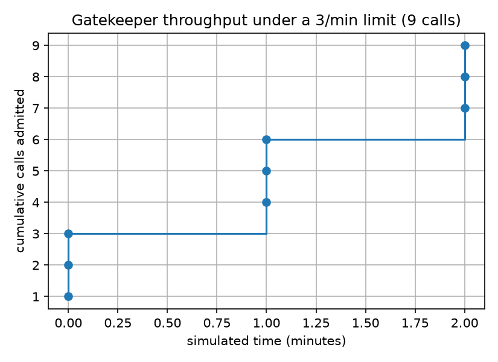

```text
Rate limiting + FIFO drain: 9 calls under a 3/min cap (no rejections):
  call 1: t=0.0 min   call 2: t=0.0 min   call 3: t=0.0 min
  call 4: t=1.0 min   call 5: t=1.0 min   call 6: t=1.0 min
  call 7: t=2.0 min   call 8: t=2.0 min   call 9: t=2.0 min
Backpressure: 5 callers queued behind a max_queue_depth of 3:
  QueueStatus(depth=5, max_depth=3, backpressure=True, enqueued=5, drained=0, peak_depth=5)
```

Thread-safety is a single `RLock` (consistent acquisition order ⇒ no deadlock) with `with`-managed
critical sections; gatekept calls are **I/O-bound**, so concurrency uses threads, not multiprocessing
(PRD_gatekeeper §6.1). For local offline runs the default gatekeeper is **unlimited** so the match stays
snappy; when `OPENAI_API_KEY` is set the CLI auto-selects a config-driven gatekeeper
(`select_gatekeeper` → `gatekeeper_from_config(rate_limits.json, "llm")`), so editing `rate_limits.json`
changes real-run throttling with **no code edit** (version-checked on load).

## R.10 ISO/IEC 25010 Quality Self-Assessment
Mapping each of the eight product-quality characteristics to concrete evidence in this project.

| # | Characteristic | How it is addressed (evidence) |
|---|---|---|
| 1 | **Functional suitability** | All FRs implemented (engine, dual MCP tools, NL coordination, scoring, reporting); 249 tests assert correctness incl. edge cases (`docs/EDGE_CASES.md`). |
| 2 | **Performance efficiency** | O(grid) move selection; gatekeeper bounds external-call rate/concurrency; token-cost analysis (R.7). I/O-bound work uses threads, not processes (R.9). |
| 3 | **Compatibility** | Pure-Python, OS-agnostic (`uv`); SDK-only core decoupled from CLI/GUI; MCP standard for agent interop. |
| 4 | **Usability** | One-command run; clear CLI banners + colored GUI HUD/legend; documented config & workflow (R.11, §2–§3). |
| 5 | **Reliability** | Defensive NL parsing (never crashes on ambiguity); gatekeeper retries + FIFO queue (never rejects); deterministic seeds; 100% branch coverage. |
| 6 | **Security** | No secrets in code (`.env`/`.env-example`, git-ignored creds); token-based Google/MCP auth; gatekeeper as single audited choke-point. |
| 7 | **Maintainability** | ≤150-line files, SDK layering, DRY, Ruff-clean, docs-first PRD/PLAN/TODO, ≥85% coverage gate, per-feature commits. |
| 8 | **Portability** | `uv`-managed deps + lockfile; config-driven (no hard-coded paths/values); local→cloud deployment path (PLAN §3). |

## R.11 Usability (UI/UX) — Nielsen's Heuristics & Accessibility
The CLI/GUI is assessed against **Nielsen's 10 usability heuristics** (a required standard):

| # | Heuristic | In this project |
|---|---|---|
| 1 | Visibility of system status | GUI HUD shows move count, whose turn, winner banner; CLI prints backend + gatekeeper call count |
| 2 | Match to the real world | Cop/thief metaphor; plain-language NL messages; compass words (north-east…) |
| 3 | User control & freedom | Run modes/flags (`--simple/--gui/--live`); window closes on demand or auto-closes; Ctrl-C safe (gatekeeper releases tickets) |
| 4 | Consistency & standards | One config schema; consistent colors (cop=blue, thief=amber) across PNG/GIF/live; standard `uv`/pytest tooling |
| 5 | Error prevention | Config version-checked on load; illegal moves fall back to STAY; unknown strategy rejected with a clear message |
| 6 | Recognition over recall | On-screen legend + labels; documented config table (§5); no hidden commands |
| 7 | Flexibility & efficiency | One-command default plus power flags; config-tunable grid/strategy/pacing without code edits |
| 8 | Aesthetic & minimalist design | Modern-dark theme, uncluttered board, single speech bubble per turn |
| 9 | Help users recover from errors | Troubleshooting table (§2.5); token re-consent path; clear exceptions |
| 10 | Help & documentation | Scientific README + `docs/` suite + `--help` |

**Accessibility:** high-contrast dark palette; cop/thief differ by **shape *and* color** (disc vs star) so
they're distinguishable without color vision; legible sans-serif HUD. *Planned:* a color-blind-safe
palette toggle and keyboard navigation for a future live window.

**Standards alignment:** **ISO/IEC 25010** (R.10), **MIT SQA** practices (docs-first, TDD, reviews),
**Google/Microsoft API** design guidance (SDK facade, gatekeeper, versioned config), and **Nielsen's 10
heuristics** (above) — see also [`docs/PLAN.md`](docs/PLAN.md) and `docs/PRD.md` §4.

## R.12 Inter-Group Match (partner interop)
Played a **live §12 inter-group series vs team `salareen`** (our group **sharNamr** — Sharbel, Amr) — **won 60–40**.

Their servers speak a **custom JSON-over-HTTP decision protocol** (`/health`, `/identity`, `/capabilities`,
`POST /decide`), **not MCP**. `/decide` is a **stateless policy**: the caller owns the game, sends a
role-filtered observation with explicit `legal_actions`, and gets back one action. So **we own the
`GameEngine`**, play our role with `strategy/ortho_policy`, and call their `/decide` for theirs (design:
[`docs/PRD_partner_interop.md`](docs/PRD_partner_interop.md); run `uv run python scripts/play_partner.py`).

**Result** (6 games · 3-cop/3-thief swap · full visibility · moves-only):

| Game | Our role | Winner | Moves | Us | Partner |
|---|---|---|---|---|---|
| 0 | cop | thief | 25 | 5 | 10 |
| 1 | cop | thief | 25 | 5 | 10 |
| 2 | cop | **cop (capture)** | 8 | 20 | 5 |
| 3 | thief | **thief** | 25 | 10 | 5 |
| 4 | thief | **thief** | 25 | 10 | 5 |
| 5 | thief | **thief** | 25 | 10 | 5 |
| **Total** | | | | **60** | **40** |

66 gatekeeper-routed `/decide` calls; JSON result emailed (§9). **Coordinate bridge** (validated live):
their `[row,col]` = our `(y,x)`; `up/down/left/right` → `(0,−1)/(0,+1)/(−1,0)/(+1,0)`.

### 🐞 Problems found & how we handled them
- **No GUI on the interop run.** `play_partner.py` is a **headless CLI** (prints JSON + emails); the
  animated/live GUI (`--gui`/`--live`) is wired only for the *local* match. The interop game state is local
  (we own the engine), so a live window can be added — not done yet.
- **Their cop `/decide` returns HTTP 500 on `place_barrier`** → interop is **moves-only** (`allow_barrier`
  off by default; barriers are an optional cop ability their server can't process).
- **Protocol asymmetry (open).** Our servers are **FastMCP**; their *bonus client* drives via **REST
  `/decide`**, so they **cannot drive the match against our MCP servers** the way we drove theirs. For the
  bonus both teams must email the **same** JSON, so either (a) we share this authoritative result and both
  report it, or (b) we expose a REST `/decide` server mirroring their protocol. See
  [`docs/PRD_partner_interop.md`](docs/PRD_partner_interop.md) §8.

### Whose architecture? + the reciprocal `/decide` bridge
**This is not our bug — the opposite.** The assignment requires the agent's brain in the **client** and the
MCP server **tools-only** (ex06 §5.2 / ADR-001). We followed it: our FastMCP servers expose tools
(`get_observation`/`submit_action`/…) but **no decision** — our policy runs in our client. salareen put the
decision **in the server** (`/decide`) and used **custom REST, not MCP** — a deviation that happens to make
*their* agents callable (handy for interop) and ours not (a spec-compliant tools-only server has no move to
hand out). So for them to **host** and pull *our* move, we add a small **reciprocal REST `/decide` server**
([`services/decide_service.py`](src/marl_cop_thief/services/decide_service.py) +
[`scripts/run_decide_server.py`](scripts/run_decide_server.py)) that mirrors their protocol and wraps our
policy — an **interop adapter only**; our MCP servers stay tools-only. Their existing client then drives us
with **zero changes**. Deploy: a third Render service in [`render.yaml`](render.yaml).

**Partner onboarding** — the problem, the target architecture, and **both** interop paths (REST `/decide` *and*
MCP, with tool schemas + the report format) for the partner's coding agent:
[`docs/PARTNER_ONBOARDING.md`](docs/PARTNER_ONBOARDING.md).

**MCP transport caveat (honest).** Our two MCP servers are deployed, token-authed and reachable (verified by
`check_mcp.py`), and the MCP tool layer + the over-MCP driver (`McpClient` / `host_server` / `play_remote.py`)
are built and tested — but the headline match (`uv run cop-thief`) runs **in-process** (orchestrator →
services), not an HTTP round-trip through the deployed server each move. Running a full 6-game *through* the
live MCP server is the one item left to make "a session managed via its MCP server" (ex06 §3) demonstrable
end-to-end (tracked as T7.33).

---

## 5. Configuration Guide
All tunables live in `config/` (nothing hard-coded). Full schema in [`docs/PLAN.md`](docs/PLAN.md) §5.1.

| Key | Type | Default | Effect |
|---|---|---|---|
| `grid_size` | `[W,H]` | `[5,5]` | Board size (generic, supports non-square e.g. `[3,2]`) |
| `max_moves` | int | `25` | Max moves per sub-game |
| `num_games` | int | `6` | Sub-games per match |
| `max_barriers` | int | `5` | Cop barrier budget per game |
| `visibility_radius` | int | `1` | Partial-observation radius |
| `seed` | int | `42` | RNG seed for deterministic match/figure runs |
| `scoring.*` | int | `20/10/5/5` | cop_win / thief_win / cop_loss / thief_loss |
| `strategy.type` | str | `heuristic` | Cop policy: `heuristic` (greedy) or `smart` (cornering, ~100% capture vs greedy thief) |
| `strategy.thief_type` | str | `smart` | Thief policy: `smart` (flee + keep escape room, roams the board) or `greedy` (distance-only baseline) |
| `gui.live_backend` / `gui.poll_interval_ms` | str / int | `TkAgg` / `150` | Live window (`--live`): interactive matplotlib backend + how often (ms) the GUI drains the frame queue while turns compute on a worker thread |
| `llm.model` | str | `gpt-4o-mini` | OpenAI model for the NL match (used when `OPENAI_API_KEY` is set) |
| `llm.pricing.*` | obj | `0.15/0.60` | `$/1M` input & output, `chars_per_token`, `est_output_tokens_per_call` (token-cost report, R.7) |
| `llm.budget.*` | obj | `5.0/0.8/2e-5` | `monthly_cap_usd` / `alert_threshold` / `usd_per_call` — real-time spend counter + overrun alert (R.7; cap `0` disables) |
| `reporting.recipient_email` | str | `sharbelma3@gmail.com` | Report recipient (→ `rmisegal+uoh26b@gmail.com` at submission) |
| `reporting.timezone` | str | `Asia/Jerusalem` | Timezone stamped into the JSON match report (read by `services/reporting.py`) |
| `google.secrets_dir` | path | _external_ | Folder (outside repo) holding `client_secret.json`/`token.json` |
| `google.scopes` | list | gmail.modify, calendar | OAuth scopes |
| `rate_limits.services.*` | obj | see file | Per-service `requests_per_minute`/`requests_per_hour`/`concurrent_max`/`retry_after_seconds`/`max_retries`/`max_queue_depth` (gatekeeper; `0` = unlimited) |

## 6. Contribution Guidelines
Follow [`CLAUDE.md`](CLAUDE.md) and the submission guidelines: docs-first, SDK-only, files ≤150 lines,
TDD ≥85% coverage, Ruff clean, `uv` only, no hardcoded values/secrets, **and report your work here**.
Develop each feature on its own branch off `main` and merge via **Pull Request** with review.

## 7. License & Credits
Licensed under the **MIT License** — see [`LICENSE`](LICENSE).
Assignment, guidelines, and Google-setup materials © **Dr. Yoram Segal** (see [`MATERIALS/`](MATERIALS/)).
Third-party libraries (attribution finalized as deps are pinned): **FastMCP**, **google-api-python-client**,
**google-auth-oauthlib**, **google-auth-httplib2**, the chosen **LLM SDK**, **Ruff**, **pytest**.
